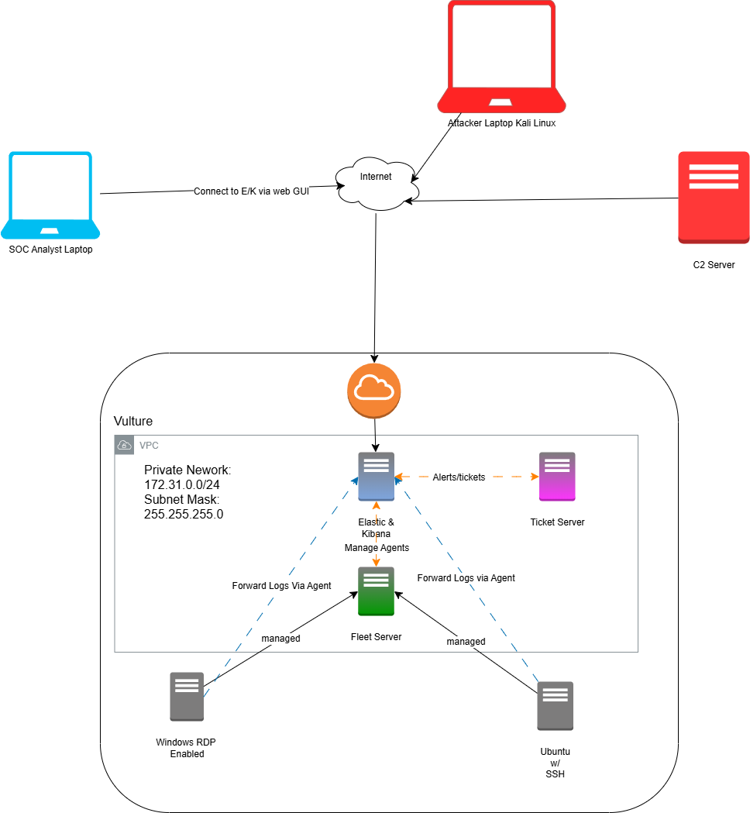

## Overview
This directory contains files related to a project I've been doing which follows a series of tutorials that you can find [here](https://www.youtube.com/watch?v=W3ExS2m6B24&list=PLG6KGSNK4PuBb0OjyDIdACZnb8AoNBeq6). 

The project aims to create a system with ElasticSearch, Logstash, and Kibana services. 
Below is a diagram that gives a rough outline of where this server will be by the end of the project:

The image depicts two endpoints, a Windows machine with Remote Desktop Protocol(RDP) enabled and a Ubuntu machine with SSH enabled.
These machines are accessible to the internet for anyone to attempt to connect to, the idea is that these represent real workstations that a company might use. 
Fleet allows us to manage log collection on both endpoints from one central location, making this project scalable to a business environment. 
