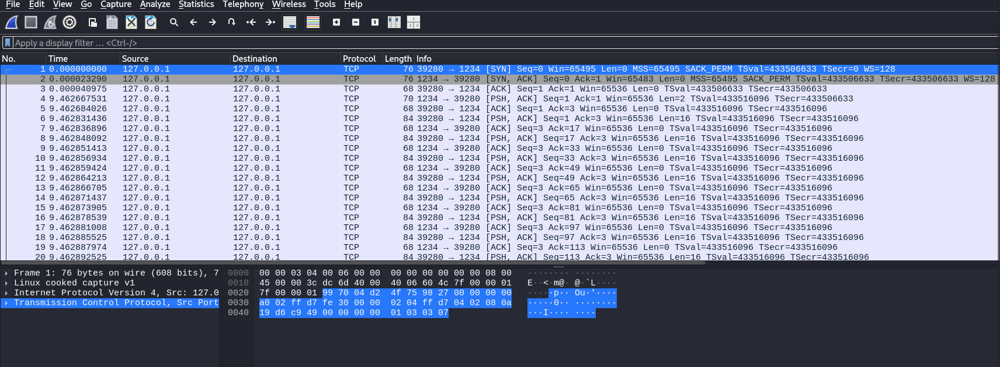
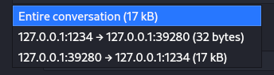

## Introduction
This project was a Capture the Flag Activity(CTF) for a reverse engineering position. Since it was part of a job application I feel it important to not share some of the exact files I used, to maintain the integrity of their selection process. That being said, I found this project immensely interesting so I wanted to document how I solved this project. 

## First steps
I was asked to figure out what a rouge process on their system was doing, I was to accomplish this by analyzing a file containing network communications(.pcap).
Knowing that this was a reverse engineering challenge, I knew the network communications likely contained a computer program within. However, to analyze that program, we would first need to analyze the network communications and extract the relevant parts.  

## Packet analysis
I opened [Wireshark](https://www.wireshark.org/), my packet analyzer of choice, and opened the .pcap file inside.
When you open Wireshark you are greeted with a view like this: 

The main pane contains some data about each packet like what the source and destination IP are, the port, what protocol they use, their length, their order, and the TCP message type. 
The bottom pane contains the actual hex values of the packet selected along with their ASCII counterparts. From this, I only knew that this was a conversation from two ports(1234 and 39280) on the same IP address. Clicking through each PSH packet I would find some bits of text that appeared to be code but I wasn't getting a clear picture. I needed to see every PSH packet all together, in order. To do this I right-clicked on one of the entries in the main pane and hit "follow" > "TCP Stream". 

Selecting this view shows the whole conversation in chronological order. There are also two other views available, one showing p:1234 -> p:39280, and the other showing p:1234 -> p:39280. 

Switching between these two views, we see that port one side only sent a few lines of plain text, while the other sent many lines of what appears to be code. 
