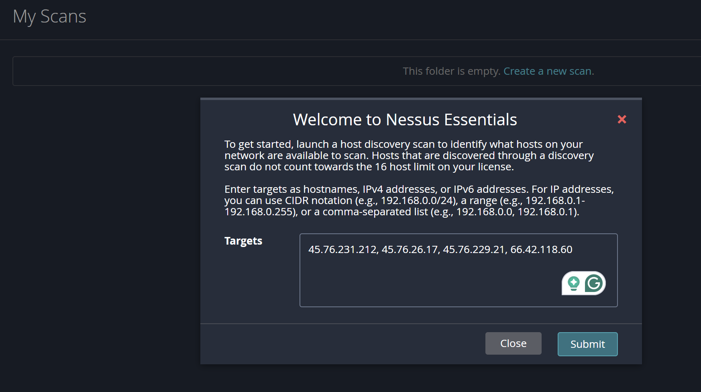
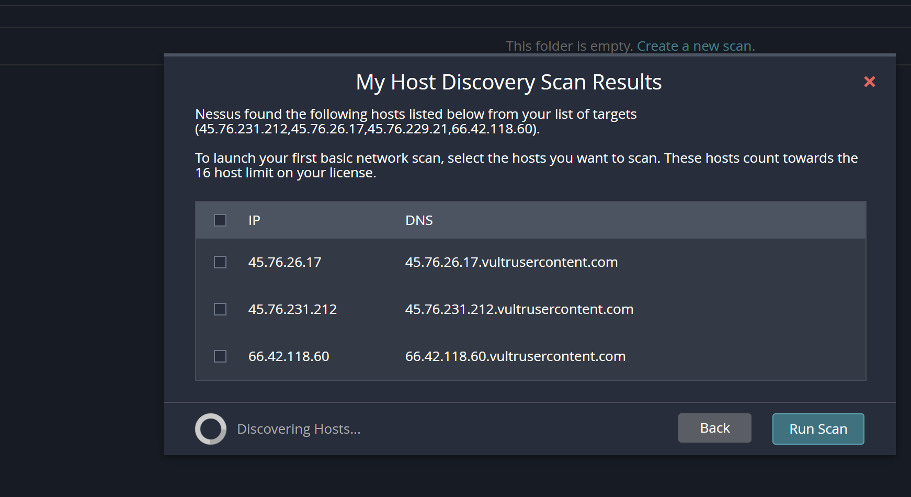
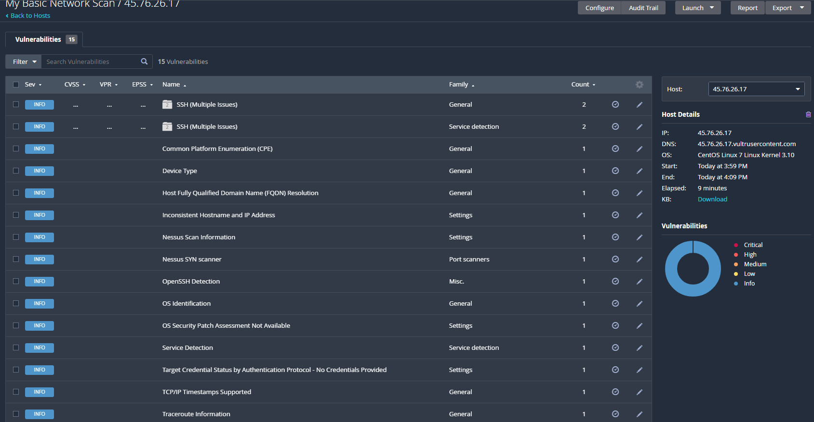
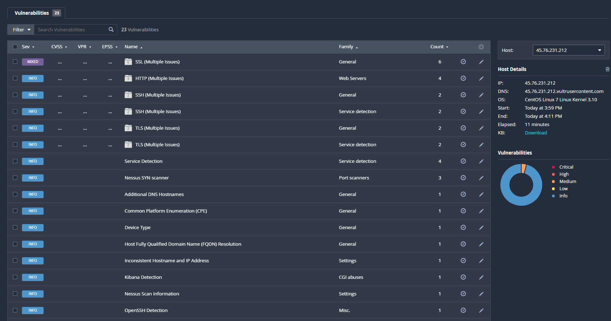
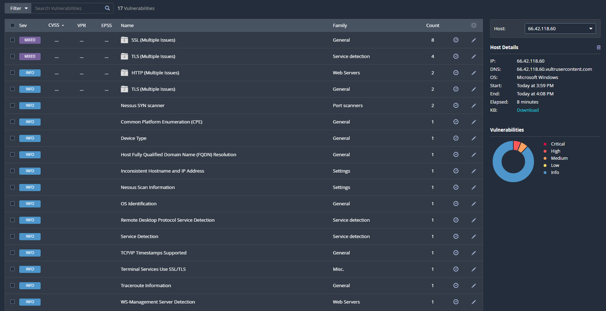
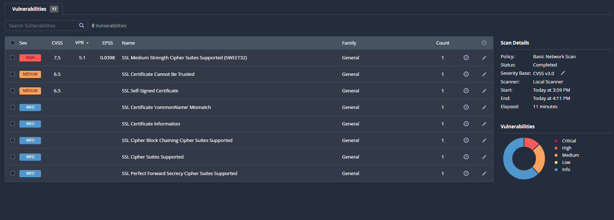
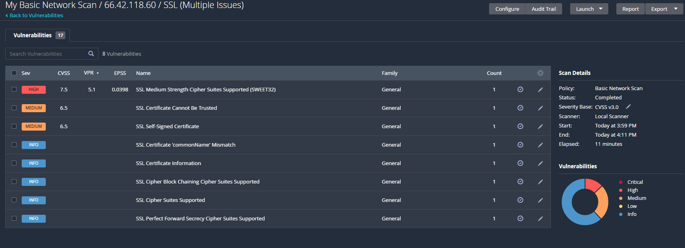
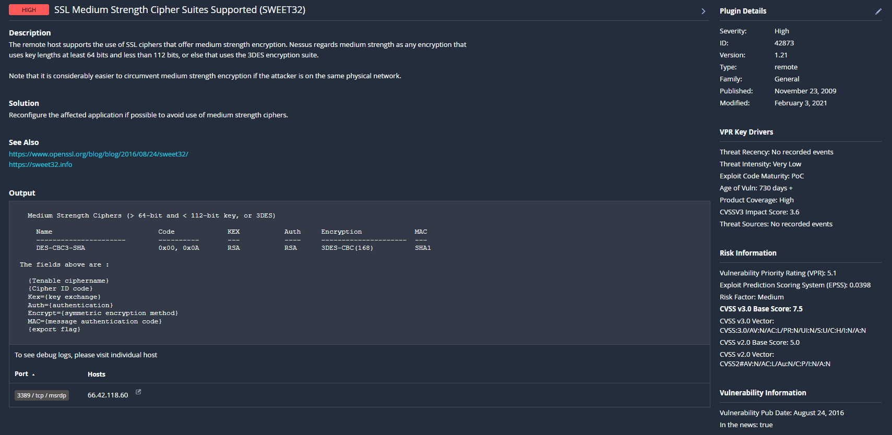
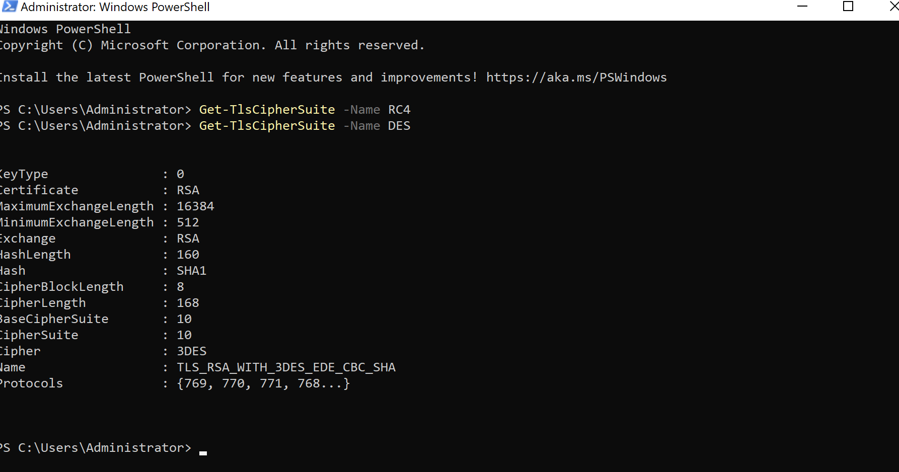
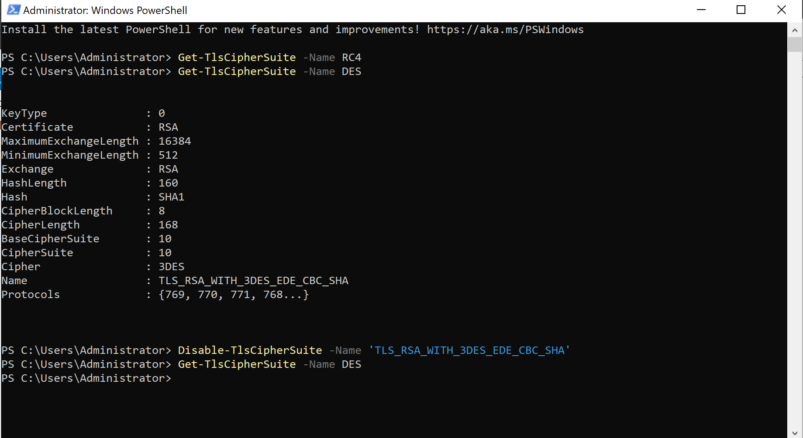

## Introduction
These are some notes on a vulnerability scan that I did of a home lab I did. 
If you want more information on how I set up this lab please visit [DFIR](https://github.com/20austna/MyCyberProjects/tree/main/DFIR).

Note: none of the IPs will be excluded from screenshots because the machines have since been taken down due to the cost of maintaining them.

## Vulnerability Assessment 

Scan on my vultr server. Start by entering IP addresses for a host discovery scan: 

I clicked submit, then checked all the boxes next to the IP addresses and hit run scan. 

Here's a look at the results of the scan for each of the 3 addresses that responded. 

45.76.26.17:

45.76.231.212:

For 66.42.118.60:

Let's take a look at the SSL issues and see if we can research the most critical ones. 

Here there are 3 vulnerabilities, SSL medium Strength Cipher Suites Supported(SWEET 32), SSL Certificate Cannot Be Trusted, and SSL Self-Signed Certificate. Let's see what we can learn about the first vulnerability. 

[More info about the attack](https://sweet32.info/)

To summarize my understanding of the attack: The attacker can exploit the small block size of some medium-strength ciphers by attempting two different input messages that collide to the same hashed value. Legacy block ciphers with a block size of 64 bits are more vulnerable to this attack because their smaller key size makes the amount of time/data needed to perform an attack like this possible. It would take too long to find a collision on a cipher with a larger key size. 

## Resolution

As seen in the previous screenshot, the remediation is to "Reconfigure the affected application if possible to avoid use of medium strength ciphers." But I had to do some research to get some more information about how to do that. 

[How to fix cve-2016-2183](https://learn.microsoft.com/en-us/answers/questions/1351265/how-do-i-fix-cve-2016-2183)

Looking up CVE-2016-2183, it can be fixed via a few simple commands. First, verify that DES is enabled:

Next, run “Disable-TlsCipherSuite -Name 'TLS_RSA_WITH_3DES_EDE_CBC_SHA'”, then check if DES is still enabled, restart the server, and run the nessus scan again. 

After restarting run Get-TlsCipherSuite -Name DES one more time to confirm that the changes were saved. 

Now run the scan again to ensure that the issue was resolved. 

## Reflection

In retrospect, I wish I had paid more attention to the other vulnerabilities or written down why I decided not to prioritize them(even if it was just because the scan says they are "medium" rather than "high"). I did this scan over a month ago and took the notes at the same time. As previously mentioned the server is no longer active but I think a good next step for this project would be to research the solutions to those vulnerabilities and document my findings. 
